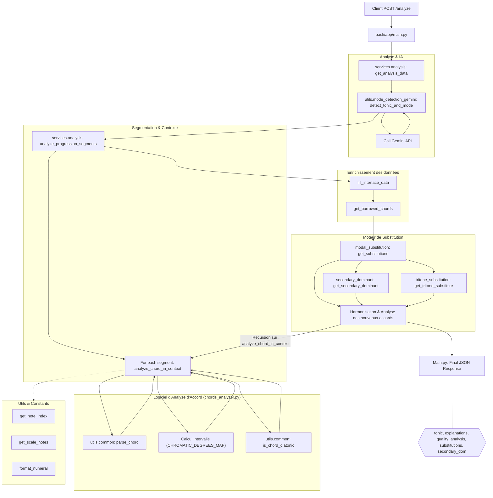

# Chords generator

From a chord progression, provide an exhaustive analysis of each chord, including its quality, borrowed chords, substitutions and more !

Tonic & mode detection are made by calling Gemini model

## Workflow



## Installation

Install requirements.txt dependencies first with:

```bash
uv venv
source .venv/bin/activate
uv pip compile pyproject.toml --extra dev -o requirements.txt
uv pip install -r requirements.txt
cd ../ && pre-commit install
```

## Run

```bash

uvicorn app.main:app --reload
```

## Tests

```bash
python3 -m pytest
```

## CI

Linting & Tests

Test locally with act:

act -j <job_name> --rm -W .github/workflows/ci.yaml
